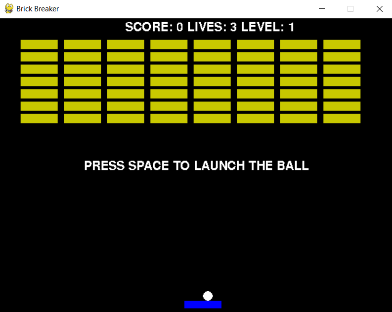
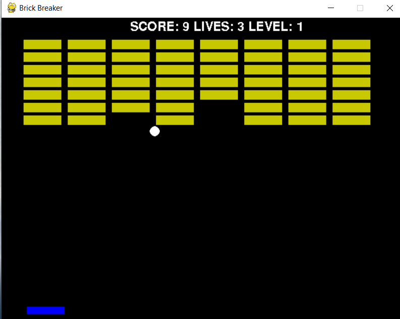
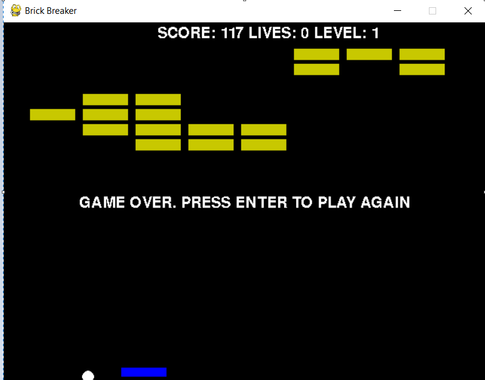

<h1 align="center">Brick Breaker</h1>
<div align="center">
  <h2> A 2D game built using computer graphics and visualization concepts in python.</h2>
    <h3>
  Name: Rohan Ajmera<br>
  Roll No: 1911002<br>
  Course: Computer Graphics & Vision<br>
  Faculty: Vaibhav Vasani<br>
  College: KJ Somaiya college of engineering<br>
  <br>
</h3>
</div>

<div align="center">

[](https://www.python.org/ "Python")

</div>

<div>

### <b>Screenshots of the project :</b>


</br>

</br>


<div align="center">

</div>


<div align="center">

</div>

### <b>To run this project :</b>

Clone the project -

```
  git clone https://github.com/rohanajm7/brick-breaker.git
```

Install all the requirements -

```
 pip install -r requirements.txt
```

Start the project, navigate to the project directory on the terminal;

### Run the script -

for linux/mac :

```
  python brickbreaker.py
```

for windows :

```
  python brickbreaker.py
```

<h4>
<b>
Scope :
</b>
</h4>
<ul>
<li>Will help understand basic and advanced concepts of Computer Graphics and Game design</li>
<li>Any number of levels can be added easily</li>
<li> Great for passing time </li>

</ul>
</div>

#### <b>Features to be added :</b>

- Include AI enemies who shoot the player
- Have bigger levels with camera panning
- Add rewards and progression

---

#### <div align="center">If you have any improvements create an issue and if you want you can also make a pull request for the same. </div>

---


<h3 align="center"><b>Developed by <a href="https://github.com/rohanajm7">Rohan Ajmera</a></b></h1>
